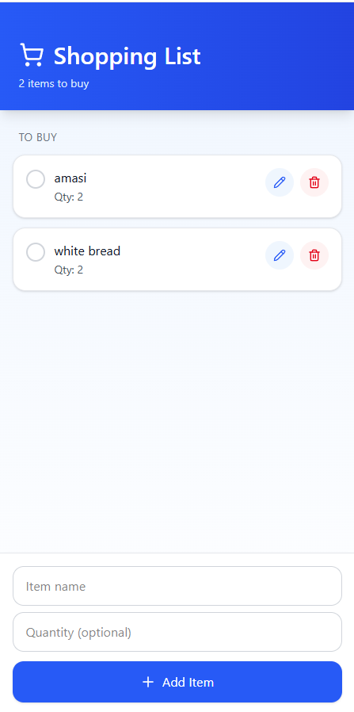

# The Shopping List

A modern, intuitive shopping list mobile application built with React Native and Expo. Easily manage your shopping items with a clean, user-friendly interface that works seamlessly on both Android and iOS devices.


#### ** I am currently out of build tokens ,so i cannot share latest APK builds **

## Screenshot



## Features

- **Add Items**: Quickly add items to your shopping list
- **Edit Items**: Tap to edit item names inline
- **Delete Items**: Remove items you no longer need
- **Mark as Purchased**: Check off items as you shop
- **Persistent Storage**: Your list is saved automatically using AsyncStorage
- **Beautiful UI**: Modern gradient design with smooth animations
- **Theme Support**: Automatic light/dark mode based on system preferences
- **Safe Area Support**: Proper handling of device notches and navigation bars

## Tech Stack

- **Framework**: Expo SDK 54
- **Runtime**: React Native 0.81.5 with React 19
- **State Management**: Redux Toolkit with React-Redux
- **Routing**: Expo Router v6 (File-based routing)
- **Language**: TypeScript
- **Persistence**: AsyncStorage
- **UI Components**:
  - Expo Linear Gradient
  - React Native Safe Area Context
  - Custom themed components
- **Icons**: @expo/vector-icons (Material Community Icons)
- **Build System**: EAS Build
- **CI/CD**: GitHub Actions

## Technical Requirements Implementation

**User Interface**: Clean, intuitive design with input fields, edit/delete buttons, and checkboxes

**Redux Setup**:

- Redux Toolkit for simplified Redux configuration
- Actions: `addItem`, `editItem`, `deleteItem`, `togglePurchased`
- Centralized state management in Redux store
- Type-safe hooks (`useAppDispatch`, `useAppSelector`)

**Shopping List Features**:

- Display items with checkboxes for purchased status
- Add new items with name and quantity
- Edit item details inline
- Delete items with confirmation dialog

**State Management**:

- All application state managed through Redux
- Actions dispatched for all state changes
- Reducers handle state updates immutably

**Persistence**:

- AsyncStorage integration for data persistence
- Automatic save on every state change
- Data loaded on app startup

**User Feedback**:

- Visual feedback for add/edit/delete operations
- Error messages displayed via Alert dialogs
- Loading indicators during data fetch

**Documentation**:

- Comprehensive README with setup instructions
- Code comments explaining Redux implementation
- User guide for app features

## Prerequisites

- Node.js (v20 or higher recommended)
- npm or yarn
- Expo Go app (for development)
- EAS CLI (for building)

## Get started

1. Install dependencies

   ```bash
   npm install
   ```

2. Start the app

   ```bash
   npm start
   ```

In the output, you'll find options to open the app in a

- [development build](https://docs.expo.dev/develop/development-builds/introduction/)
- [Android emulator](https://docs.expo.dev/workflow/android-studio-emulator/)
- [iOS simulator](https://docs.expo.dev/workflow/ios-simulator/)
- [Expo Go](https://expo.dev/go), a limited sandbox for trying out app development with Expo

You can start developing by editing the files inside the **app** directory. This project uses [file-based routing](https://docs.expo.dev/router/introduction).

## Platform-Specific Commands

```bash
npm run android  # Run on Android
npm run ios      # Run on iOS
npm run web      # Run in web browser
```

## Download

Download the latest Android APK:
[Download Shopping List APK](https://expo.dev/artifacts/eas/2fBhNK366vB7G6R68oTtJL.apk)

## Building for Production

### Using EAS Build

1. Install EAS CLI globally:

```bash
npm install -g eas-cli
```

2. Login to your Expo account:

```bash
eas login
```

3. Build for Android (APK):

```bash
eas build --platform android --profile preview
```

4. Build for production:

```bash
eas build --platform android --profile production
```

### CI/CD

The project includes automated builds via GitHub Actions. Pushes to the `main` branch automatically trigger Android APK builds using EAS Build.

## Project Structure

```
The_Shopping_List/
├── app/                        # File-based routing
│   ├── _layout.tsx            # Root layout with Redux Provider
│   ├── index.tsx              # Main shopping list screen
│   └── (tabs)/                # Tab navigation group
├── assets/                     # Images and static files
│   └── images/
│       └── shopping-list-logo.png
├── components/                 # Reusable components
│   ├── add-item-form.tsx      # Bottom form for adding items
│   ├── shopping-item-card.tsx # Individual item card
│   ├── themed-text.tsx        # Theme-aware text component
│   └── themed-view.tsx        # Theme-aware view component
├── constants/                  # App constants
│   └── theme.ts               # Color and font definitions
├── store/                      # Redux store configuration
│   ├── index.ts               # Store setup and configuration
│   ├── shoppingSlice.ts       # Shopping list slice (actions & reducers)
│   └── hooks.ts               # Typed Redux hooks
├── hooks/                      # Custom hooks
│   ├── use-color-scheme.ts    # Color scheme detection
│   └── use-theme-color.ts     # Theme color helper
├── types/                      # TypeScript types
│   └── shopping.ts            # Shopping item interfaces
├── utils/                      # Utility functions
│   └── storage.ts             # AsyncStorage wrapper
├── app.json                   # Expo configuration
├── eas.json                   # EAS Build configuration
├── package.json               # Dependencies
└── tsconfig.json              # TypeScript config
```

## Redux Architecture

### Store Configuration (`store/index.ts`)

- Configures Redux store with Redux Toolkit
- Subscribes to store changes for AsyncStorage persistence
- Exports typed `RootState` and `AppDispatch` types

### Shopping Slice (`store/shoppingSlice.ts`)

**State:**

- `items`: Array of shopping items
- `isLoading`: Loading state indicator
- `error`: Error message string

**Actions:**

- `addItem(payload)`: Add new item to the list
- `editItem(payload)`: Update item name and quantity
- `deleteItem(id)`: Remove item from the list
- `togglePurchased(id)`: Toggle purchased status
- `setItems(items)`: Load items from storage
- `setLoading(bool)`: Set loading state
- `setError(message)`: Set error message
- `clearError()`: Clear error state

**Reducers:**

- Immutably update state based on dispatched actions
- Validate item existence before updates
- Set error states for failed operations

### Custom Hooks (`store/hooks.ts`)

- `useAppDispatch`: Typed dispatch hook
- `useAppSelector`: Typed selector hook

### Usage Example:

```typescript
import { useAppDispatch, useAppSelector } from "@/store/hooks";
import { addItem, deleteItem } from "@/store/shoppingSlice";

// In component
const dispatch = useAppDispatch();
const items = useAppSelector((state) => state.shopping.items);

// Dispatch actions
dispatch(addItem({ name: "Milk", quantity: "2" }));
dispatch(deleteItem("item-id"));
```

## Key Components

### Main Screen (`app/index.tsx`)

The main shopping list interface with:

- Redux integration for state management
- Scrollable list of items
- Add item form at the bottom
- Error message dialogs
- Keyboard dismissal on tap

### Shopping Item Card (`components/shopping-item-card.tsx`)

Individual item display with:

- Checkbox for marking purchased
- Inline editing
- Delete button
- Auto-focus when editing

### Add Item Form (`components/add-item-form.tsx`)

Bottom-fixed form with:

- Text input with validation
- Safe area insets support
- Keyboard return key handling

## Storage & Persistence

Shopping list data is persisted using:

- **Storage Layer**: AsyncStorage for local persistence
- **Redux Integration**: Store automatically saves to AsyncStorage on state changes
- **Key**: `shopping-list-items`
- **Format**: JSON array of shopping items
- **Auto-save**: Triggered by Redux store subscription
- **Load on Startup**: Data loaded during app initialization before Redux store setup

## Development

### Install Dependencies

First, install all required packages including Redux:

```bash
npm install
```

### Running the App

```bash
npm start          # Start Expo development server
npm run android    # Run on Android
npm run ios        # Run on iOS
npm run web        # Run in web browser
```

### Linting

```bash
npm run lint
```

### Testing Redux

To test Redux actions and reducers:

```typescript
import { store } from "@/store";
import { addItem, editItem, deleteItem } from "@/store/shoppingSlice";

// Test adding an item
store.dispatch(addItem({ name: "Test Item", quantity: "1" }));
console.log(store.getState().shopping.items);

// Test editing an item
const itemId = store.getState().shopping.items[0].id;
store.dispatch(editItem({ id: itemId, name: "Updated", quantity: "2" }));

// Test deleting an item
store.dispatch(deleteItem(itemId));
```

**Integration Testing:**

- Test Redux actions dispatch correctly
- Verify reducers update state immutably
- Confirm AsyncStorage persistence works
- Validate error handling and user feedback

### Reset Project

```bash
npm run reset-project
```

Moves starter code to `app-example/` and creates a blank `app/` directory.

## Configuration

### App Configuration (`app.json`)

- **App Name**: Shopping List
- **Package**: com.siyabongakhanyile.shoppinglist
- **Minimum SDK**: 24 (Android 7.0)
- **Target SDK**: 36

### Build Configuration (`eas.json`)

- **Preview**: APK builds for testing
- **Production**: Optimized release builds

## Troubleshooting

### App crashes on launch

- Ensure all dependencies are installed: `npm install`
- Clear cache: `npm start --clear`
- Rebuild the app

### Build failures

- Check EAS Build logs for specific errors
- Ensure `eas.json` configuration is correct
- Verify all required credentials are set

### Storage not persisting

- Check AsyncStorage permissions
- Verify storage.ts utility functions
- Check for errors in console

## Learn more

To learn more about developing your project with Expo, look at the following resources:

- [Expo documentation](https://docs.expo.dev/): Learn fundamentals, or go into advanced topics with our [guides](https://docs.expo.dev/guides).
- [Learn Expo tutorial](https://docs.expo.dev/tutorial/introduction/): Follow a step-by-step tutorial where you'll create a project that runs on Android, iOS, and the web.

## Author

Siyabonga Khanyile

## Acknowledgments

- Built with [Expo](https://expo.dev)
- Icons from [@expo/vector-icons](https://icons.expo.fyi)
- UI inspiration from modern mobile design patterns
